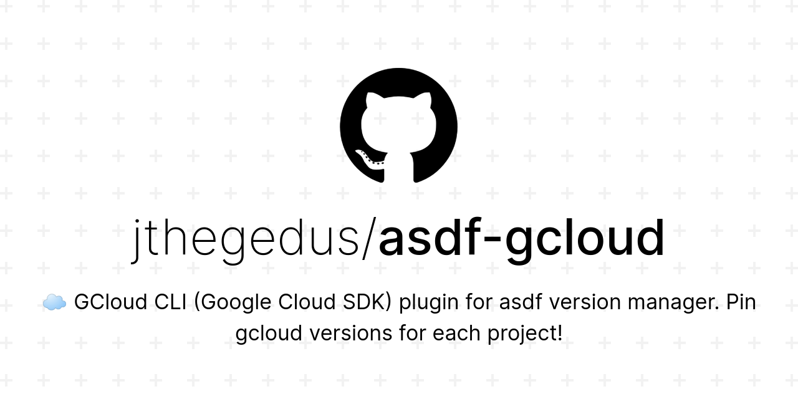

<div align="center">

# asdf-gcloud  

<a href="https://cloud.google.com/sdk/gcloud/reference" target="_blank" rel="noopener noreferrer">
  
</a>

[GCloud CLI](https://cloud.google.com/sdk/gcloud/reference) plugin for [asdf version manager](https://asdf-vm.com) allowing you to pin `gcloud` versions for each GCP project.



</div>

# Contents

- [Dependencies](#dependencies)
- [Install](#install)
- [Why?](#why)
- [Supported Versions](#supported-versions)
- [Default Cloud SDK Components](#default-cloud-sdk-components)
- [Contributing](#contributing)
- [License](#license)

# Dependencies

Are tracked in [lib/dependencies.txt](lib/dependencies.txt) and checked on installation of plugin and `asdf install gcloud *`. The core dependencies are: `bash`, `curl`, `python`, `sort`, `tar`.

# Install

Plugin:

```shell
asdf plugin add gcloud https://github.com/jthegedus/asdf-gcloud
```

GCloud:

```shell
asdf install gcloud latest
```

Set global version:

```shell
asdf global gcloud latest
```

These commands also apply to `asdf local gcloud <version>`.

# Why?

The asdf config file, `.tool-versions`, allows pinning each tool in your project to a specific version. This ensures that ALL developers are using the same version of each tool. Same `python`, same `gcloud`, same `terraform` etc.

When you update a version in `.tool-versions`, `asdf` will prompt all users who do not have the correct versions to upgrade. This enables whole teams to update their tools in unison.

# Supported Versions

gcloud releases from 352.0.0 and higher can be installed.

# Default Cloud SDK Components

`asdf-gcloud` can automatically install a set of Cloud SDK Components after each `asdf install gcloud <version>`. To enable this feature you must have a file that lists one COMPONENT_ID per line. For example:

```
alpha
beta
cloud-build-local
cloud-firestore-emulator
```

This file must be named `.default-cloud-sdk-components` and be at one of the following locations:

- `$CLOUDSDK_CONFIG/.default-cloud-sdk-components`: next to gcloud auth configurations
- `$HOME/.config/gcloud/.default-cloud-sdk-components`: next to gcloud auth configurations
- `$(dirname ASDF_CONFIG_FILE)/.default-cloud-sdk-components`: relative to `.asdfrc` if configured
- `$HOME/.default-cloud-sdk-components`: Home dir

> NOTE: by default `CLOUDSDK_CONFIG=$HOME/.config/gcloud`

Below is the list of available components (as of version `342.0.0`):

```
┌────────────────────────────────────────────────────────────────────────────────────────────────────────────┐
│                                                 Components                                                 │
├───────────────┬──────────────────────────────────────────────────────┬──────────────────────────┬──────────┤
│     Status    │                         Name                         │            ID            │   Size   │
├───────────────┼──────────────────────────────────────────────────────┼──────────────────────────┼──────────┤
│ Not Installed │ App Engine Go Extensions                             │ app-engine-go            │  4.9 MiB │
│ Not Installed │ Appctl                                               │ appctl                   │ 21.0 MiB │
│ Not Installed │ Cloud Bigtable Command Line Tool                     │ cbt                      │  7.7 MiB │
│ Not Installed │ Cloud Bigtable Emulator                              │ bigtable                 │  6.6 MiB │
│ Not Installed │ Cloud Datalab Command Line Tool                      │ datalab                  │  < 1 MiB │
│ Not Installed │ Cloud Datastore Emulator                             │ cloud-datastore-emulator │ 18.4 MiB │
│ Not Installed │ Cloud Firestore Emulator                             │ cloud-firestore-emulator │ 40.5 MiB │
│ Not Installed │ Cloud Pub/Sub Emulator                               │ pubsub-emulator          │ 60.4 MiB │
│ Not Installed │ Cloud SQL Proxy                                      │ cloud_sql_proxy          │  7.6 MiB │
│ Not Installed │ Cloud Spanner Emulator                               │ cloud-spanner-emulator   │ 21.8 MiB │
│ Not Installed │ Emulator Reverse Proxy                               │ emulator-reverse-proxy   │ 14.5 MiB │
│ Not Installed │ Google Cloud Build Local Builder                     │ cloud-build-local        │  6.3 MiB │
│ Not Installed │ Google Container Registry's Docker credential helper │ docker-credential-gcr    │  1.8 MiB │
│ Not Installed │ Kustomize                                            │ kustomize                │ 25.9 MiB │
│ Not Installed │ Minikube                                             │ minikube                 │ 50.4 MiB │
│ Not Installed │ Nomos CLI                                            │ nomos                    │ 22.9 MiB │
│ Not Installed │ On-Demand Scanning API extraction helper             │ local-extract            │ 13.6 MiB │
│ Not Installed │ Skaffold                                             │ skaffold                 │ 16.8 MiB │
│ Not Installed │ anthos-auth                                          │ anthos-auth              │ 16.8 MiB │
│ Not Installed │ config-connector                                     │ config-connector         │ 44.6 MiB │
│ Not Installed │ gcloud Alpha Commands                                │ alpha                    │  < 1 MiB │
│ Not Installed │ gcloud Beta Commands                                 │ beta                     │  < 1 MiB │
│ Not Installed │ gcloud app Java Extensions                           │ app-engine-java          │ 52.4 MiB │
│ Not Installed │ gcloud app Python Extensions                         │ app-engine-python        │  6.1 MiB │
│ Not Installed │ gcloud app Python Extensions (Extra Libraries)       │ app-engine-python-extras │ 27.1 MiB │
│ Not Installed │ kpt                                                  │ kpt                      │ 11.7 MiB │
│ Not Installed │ kubectl                                              │ kubectl                  │  < 1 MiB │
│ Not Installed │ kubectl-oidc                                         │ kubectl-oidc             │ 16.8 MiB │
│ Not Installed │ pkg                                                  │ pkg                      │          │
│ Installed     │ BigQuery Command Line Tool                           │ bq                       │  < 1 MiB │
│ Installed     │ Cloud SDK Core Libraries                             │ core                     │ 18.6 MiB │
│ Installed     │ Cloud Storage Command Line Tool                      │ gsutil                   │  3.9 MiB │
└───────────────┴──────────────────────────────────────────────────────┴──────────────────────────┴──────────┘
```

# Contributing

Contributions of any kind welcome! See the [contributing guide](CONTRIBUTING.md).

[Thanks goes to these contributors](https://github.com/jthegedus/asdf-gcloud/graphs/contributors)!

## Why are there Node deps here?

I decided the value of [commitlint](https://commitlint.js.org/#/) & sharing Git Hooks with [husky](https://typicode.github.io/husky/#/) were greater than the cost of including these deps. Not only this, but dogfooding `asdf` for dev deps makes this less of an issue.

# License

[MIT License](LICENSE) © [James Hegedus](https://github.com/jthegedus/)
